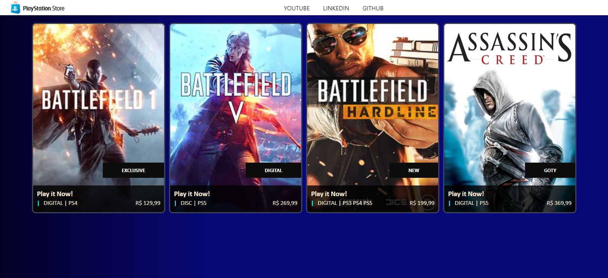

# PSN Store Angular

**PSN Store Clone - Angular Project**



---

### Descrição do Projeto

Este é um projeto de clone da interface da PlayStation Store (PSN) desenvolvido utilizando Angular. O objetivo deste projeto é recriar a tela da PSN Store em um ambiente web, utilizando as tecnologias modernas do Angular.

### Tecnologias Utilizadas

- **Angular:** Um framework de desenvolvimento de aplicativos web desenvolvido e mantido pelo Google.
  
- **HTML/CSS:** Linguagens fundamentais para a criação de interfaces web.

### Como Executar o Projeto

1. **Instalação das Dependências:**
   ```
   npm install
   ```

2. **Execução do Servidor de Desenvolvimento:**
   ```
   ng serve
   ```

3. **Navegue para:** `http://localhost:4200/`
